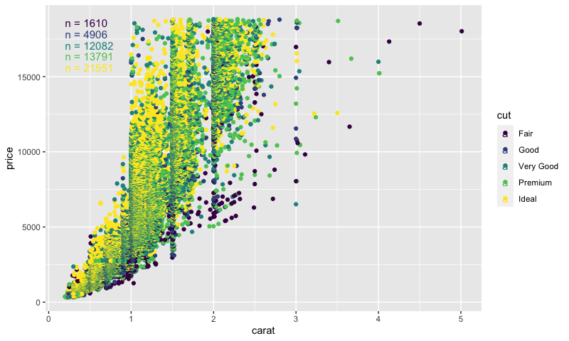

# ggobservation

## Overview
ggobservation is an extension for ggplot2 which count the number of observations and plots it using the `geom_observation()` function.

## Installation
```{r}
# This package should be installed from GitHub:
# install.packages("devtools")
devools::install_github("Holer90/ggobservation")
```

## Usage
To use ggobservation simply add the `geom_observation()` layer to the plot. The underlying stat (counting) is automatically calculated for all panels or groups, so it integrates with `colour` and `facets`.
```
library(ggplot2)
library(ggobservation)

ggplot(mpg, aes(displ, hwy, colour = drv)) + 
  geom_point() + 
  geom_observation()
```



## Settings
These settings are available to `geom_observation()`.

* `compute`: (`group`, `panel`) controls if calculations are per panel or per group.
* `hjust`: (`top`, `middle`, `bottom`) where the annotation is added horizontally
* `vjust`: (`left`, `center`, `right`) where the annotation is added vertically
* `prefix`: (string, default: `"n = "`) the prefix before the count.
* `suffix`: (string, default: `""`) the suffix after the count.
* `separation_factor`: (number, default: `1`) the separation of annotations when there are multiple groups in a single panel.


## Tasks
* Write documentation
* Add Examples with pictures to README
* Fix spacing for `compute = "group"`, and deprecate `separation_factor`.
* Do I need the helper functions, or do I get them by loading tidyverse?
* Add `label` setting, which extend geom_label instead of geom_text.
